# RankSystem - Руководство по установке и настройке

## Disclamer
На данный момент я не рекомендую пользоваться версией 1.0.0 стримербота, так как имеются проблемы работы интеграции с миничатом с этой версией.

## 📋 Системные требования

- **Streamer.bot**: версия 0.2.8
- **.NET Runtime**: .NET 4.0 Desktop Runtime. Обычно уже установлен вместе с windows.

## Шаг 1: подготовка
1. Убедитесь, что у вас установлен Streamer.bot версии 0.2.8, если вы планируете подключать сторонние площадки через интеграцию с миничатом. Если нет, то подойдёт 0.2.8+
2. Скачайте файл `RankSystem.txt` из последнего релиза.
3. Скачайте файл `System.Data.SQLite.dll` из последнего релиза.
4. В директории стримербота найдите директорию `dlls` и скопируйте в неё `System.Data.SQLite.dll`.
⚠ если директория отсутствует и у вас версия 0.2.8 -- запустите стримербот, директория создастся автоматически.
Если у вас версия 1.0.0+ -- создайте директорию самостоятельно.
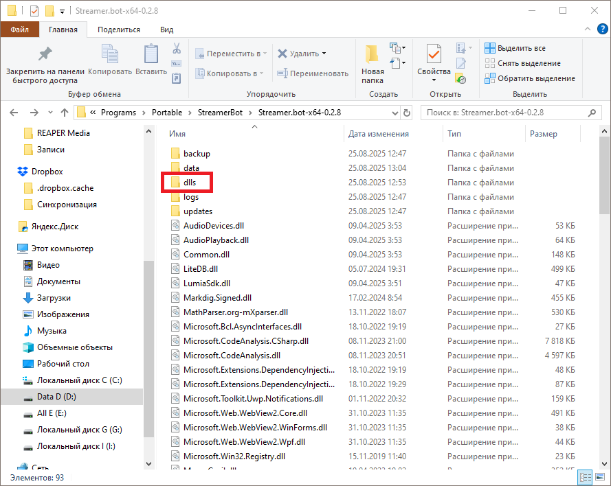

### Шаг 2: Импорт RankSystem
1. Запустите стримербот, если он ещё не запущен.
2. В верхнем меню нажмите кнопку `Import`.
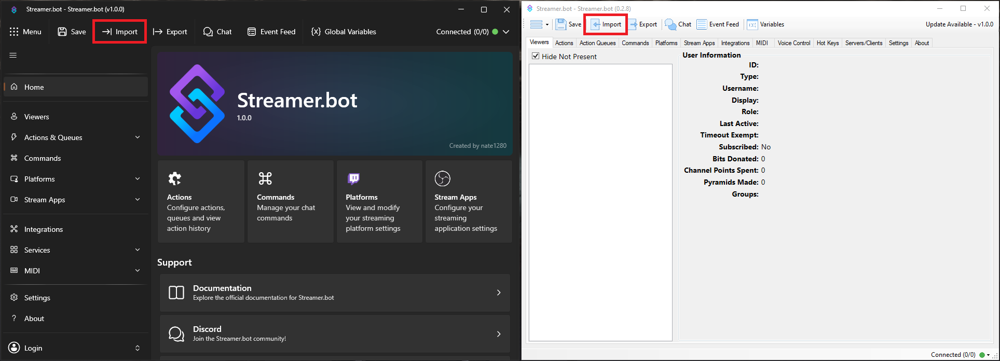
3. Перетащите скачанный ранее `RankSystem.txt` в область `Import String`. Если перетащить не получается, откройте файл блокнотом, скопируйте текст и вставьте его в `Import String`.
4. В версии 1.0.0+ Поле `Import String` исчезнет после вставки файла/текста. Нажмите `Import`.
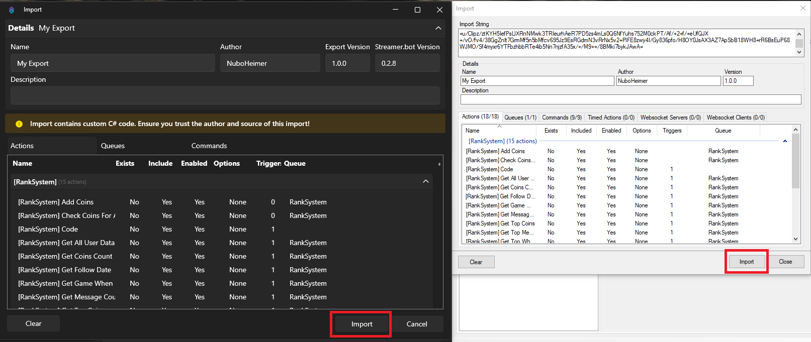
5. Версия 1.0.0+ предупредит вас, что вы импортируете кастомный c# код. Нажмите Yes.
6. Будет предупреждение, что импортируемые команды будут отключены -- стандартное поведение импорта. Соглашаемся.
7. Переходим в раздел `Actions`.
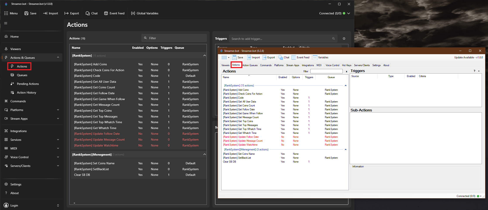
8. Выбираем экшен `[RankSystem] Code` и открываем единственный сабэкшен.
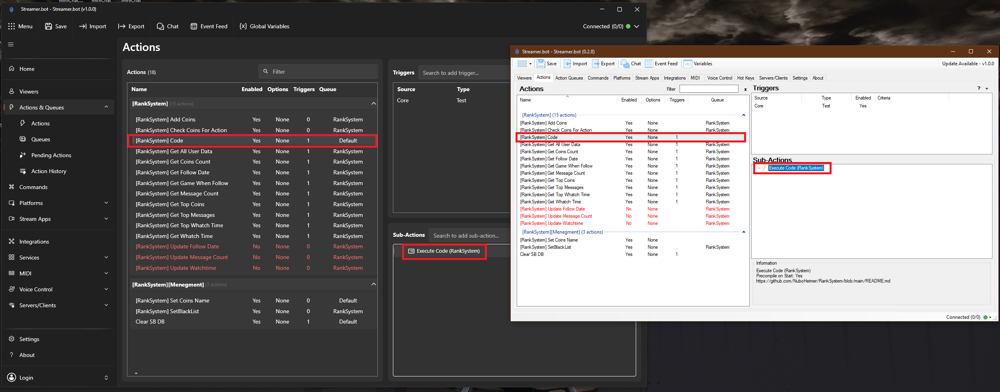
9. Нажимаем `Find Refs`.
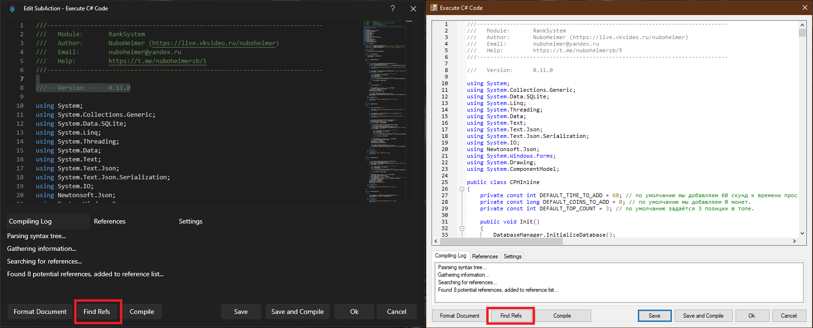
10. Нажимаем Compile и, с большой вероятностью видим две ошибки. Если ошибок нет, то нажимаем Save and Compile.
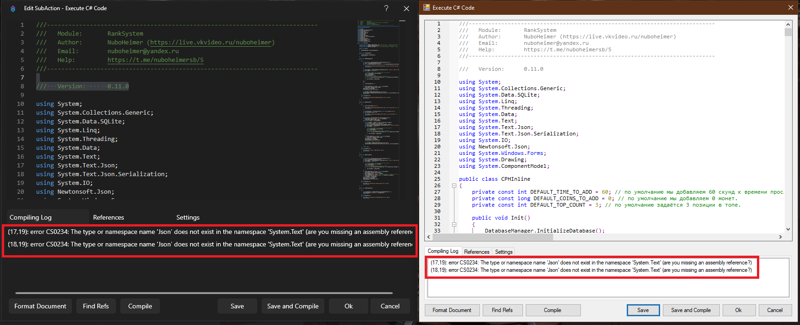
11. Если ошибки были, переключаемся на вкладку References, нажимаем в поле правой кнопкой мыши и выбираем `Add reference from file...`
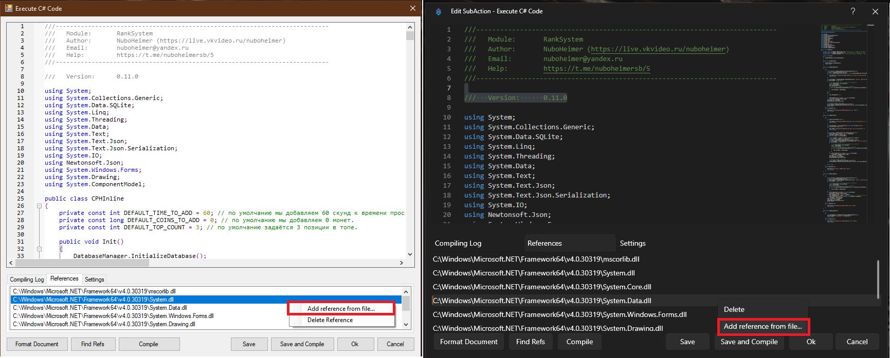
12. Переходим в директорию стримербота, находим там `System.Text.Json.dll` и выбираем его.
13. Переключаемся на вкладку `Compiling Log`, ещё раз нажимаем Compile и видим сообщением `Compiled successfully!`. Если нет -- пишите, будем разбираться.
14. Нажимаем `Save and Compile`.

Установка завершена.

## ⚙️ Первичная настройка

### Шаг 1: Настройка платформ

#### Twitch

1. Перейдите в раздел **Platforms** → **Twitch** → **Settings** 
2. Включите **Present Viewers**:
   - Поставьте галочку **Enabled**
   - Поставьте галочку **Live Update**
   - Установите ползунок на `1 minute`
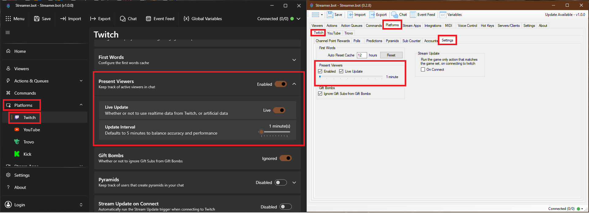

#### YouTube

1. Перейдите в раздел **Platforms** → **YouTube**
2. Включите **Present Viewers**:
   - Поставьте галочку **Enabled** (в версии 1.0.0)
   - Установите ползунок на `10 minutes`
   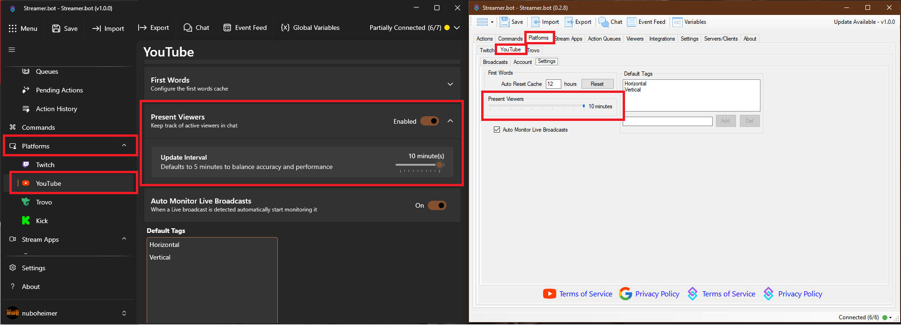

#### Trovo

1. Перейдите в раздел **Platforms** → **Trovo**
2. Включите **Present Viewers**:
   - Поставьте галочку **Enabled**
   - Установите ползунок на `10 minutes`
   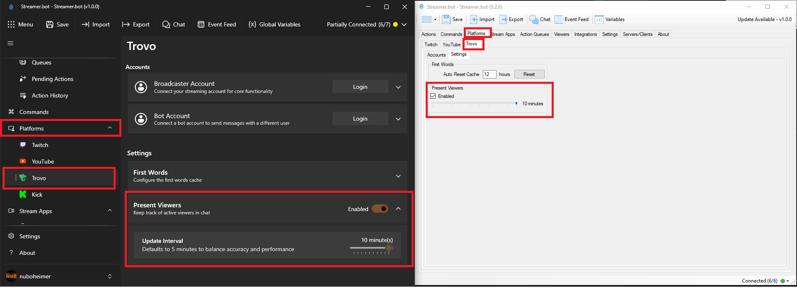

#### Kick (только в версиях 1.0.0+)

1. Перейдите в раздел **Platforms** → **Kick**
2. Включите **Present Viewers**:
   - Поставьте галочку **Enabled**
   - Установите ползунок на `10 minutes`
   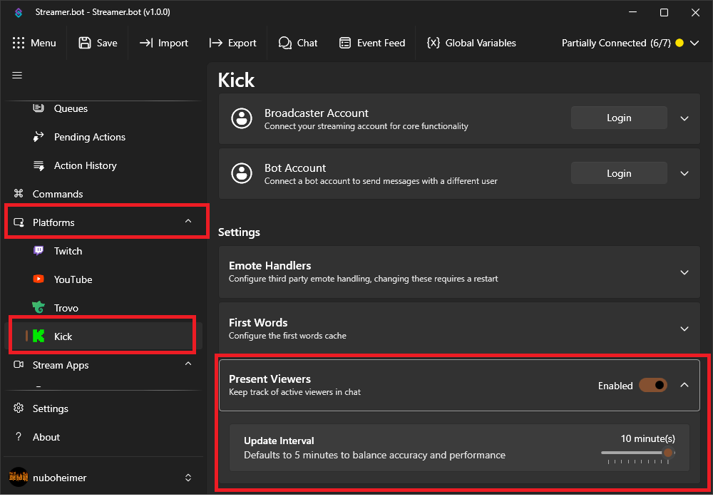

## 🔧 Базовые экшены и их использование

### 1. Предварительная подготовка

Некоторые экшены в модуле изначально отключены:
- \[RankSystem] Update Follow Date
- \[RankSystem] Update Message Count
- \[RankSystem] Update Watchtime

Это сделано во избежание их срабатывания, когда стрим оффлайн.

Рекомендую сделать следующие два экшена:
1. С триггером streamer.bot started. Который будет явно выключать эти три экшена при запуске бота.
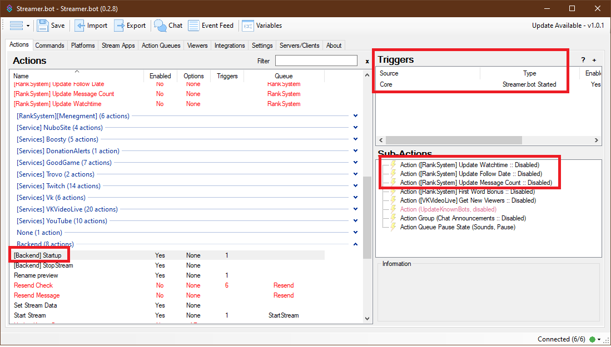

2. С триггером на старт стрима. Например, через отслеживание старта стрима в обс, или на твиче. У меня этот экшен активируется кнопкой на стримдеке. И, в числе прочего, включает эти три экшена.
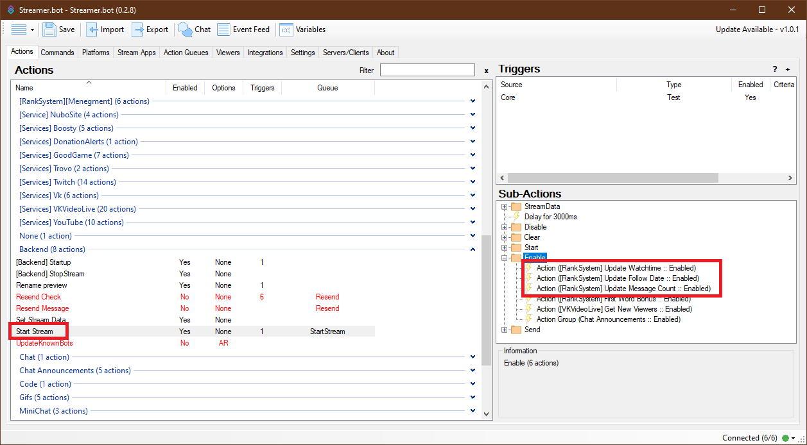

### Использование функционала.

⚠ Все экшены, использующие функционал ранговой системы, по возможности должны находиться в очереди RankSystem.

Для отправки сообщений с ответами используется внутренний метод SendReply. Он отправляет ответ на ту площадку, с которой была вызвана команда. 

Работает следующим образом: для твича, трово, ютуба (в будущем и кика) отправляет сообщение ровно тем же способом, как если бы вы сделали сабэкшен send message to chat. Для площадок из миничата вызывает метод из интеграции с миничатом. Не стал полностью завязываться на метод из интеграции, который работает по той же логике, посколько моя система может использовать и только для площадок, встроенных в бота. А в боте нет метода позволяющего отправить сообщение на площадку, с которой вызывалась команда.

#### \[RankSystem] Add Coins
Экшен может быть вызыван через Run Action в любом экшене, за вызов которого вы хотите начислить зрителю баллы.

Перед вызовом экшена, необходимо задать через Set Argument агрумент `coinsToAdd` -- количество начисляемых коинов.
На скриншоте ниже показан пример начисления коинов за рейд.
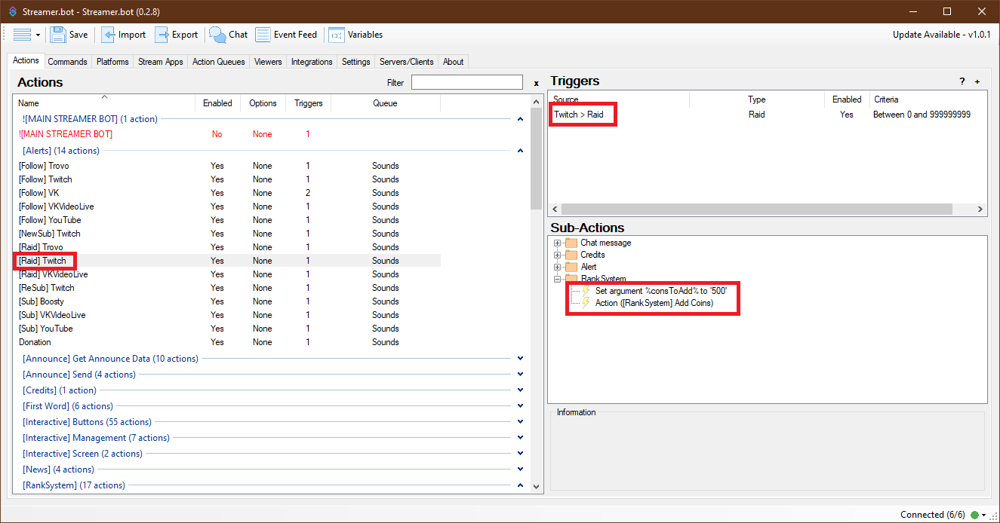

#### \[RankSystem] Check Coins For Action
Может использоваться через Run Action в "платных" командах, за использование которых вы хотите списывать коины. И проверять, достаточно ли вообще у пользователя их для использования команды.

Перед вызовом проверки необходимо задать следующие аргументы:
- `actionCurrency` -- стоимость вызываемого действия.
- `reply` -- ответ, на случаей если у зрителя не хватает коинов.

На скришоте ниже пример тестового экшена проверки стоимости команды.
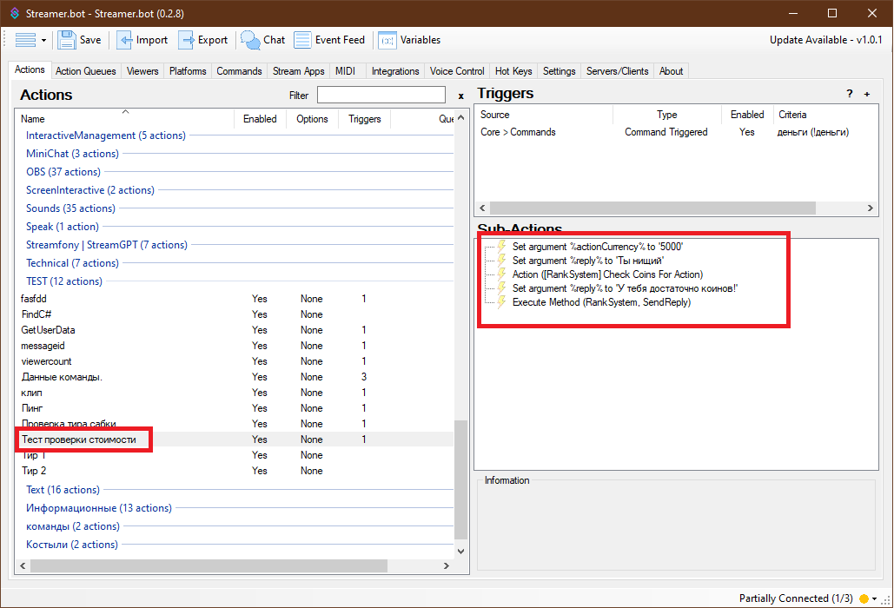

#### \[RankSystem] Get All User Data
Это экшен-пример, показывающий вывод всех данных пользователя. В нём используются экшены, описанные далее в этом руководстве.

#### \[RankSystem] Get Coins Count
Преднастроенный экшен-пример, показывающий получение количества коинов зрителя, вызвавшего команду. Количество записывается в аргумент `coins`.

#### \[RankSystem] Get Follow Date
Это экшен-пример, показывающий дату фоллова зрителя, вызвашего команду. Дата записывается в аргумент `followDate`.

#### \[RankSystem] Get Game When Follow
Это экшен-пример, показывающий категорию, на которой зафолловился зритель. На данный момент, категория запоминается только для твича. Категория записывается в аргумент `gameWhenFollow`.

#### \[RankSystem] Get Whatch Time
Это экшен-пример, показывающий количество времени насмотренного зрителем. Записывается в аргумент `watchTime`.

#### \[RankSystem] Get Message Count
Это экшен-пример, показывающий количество сообщений зрителя. Количество записывается в аргумент `messageCount`.

#### \[RankSystem] Get Top Coins
Это экшен-пример, показывающий топ зрителей по количеству накопленных коинов за всё время.

#### \[RankSystem] Get Top Messages
Это экшен-пример, показывающий топ зрителей по количеству сообщений за всё время.

#### \[RankSystem] Get Top Whatch Time
Это экшен-пример, показывающий топ зрителей по количеству времени просмотра за всё время.

#### \[RankSystem] Update Follow Date
Обновляет дату фоллова, при срабатывании. Для событий, приходящих напрямую в стримербот берёт текущую дату и время. Для событий, приходящих через миничат берёт дату события. Т.е повторение из журнала событий не перетрёт дату.

- На данный момент этот экшен надо вызвать из отдельных экшенов для каждой площадки. Нужно дополнительное тестирование.
- Для получения категории стрима твича необходимо вызвать сабэкшен Twitch Add targe info for broadcaster.
- Для начисления валюты за фоллов необходимо задать аргумент `coinsToAdd`
Ниже представлен пример настройки для твича.
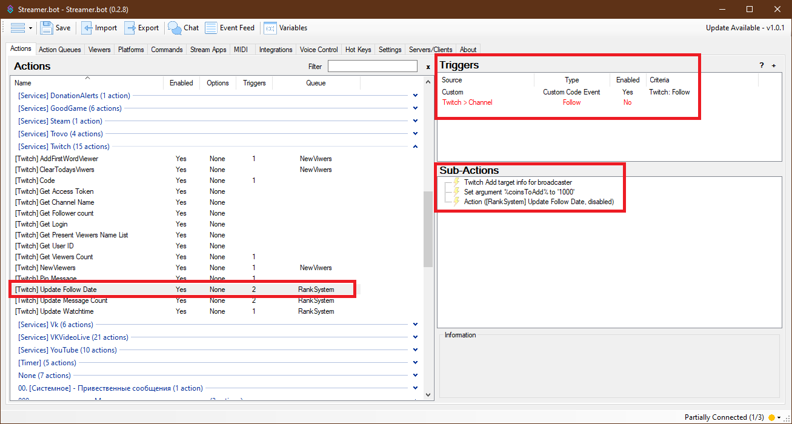

#### \[RankSystem] Update Message Count
Обновляет количество сообщений, при срабатывании.

- На данный момент этот экшен надо вызвать из отдельных экшенов для каждой площадки. Нужно дополнительное тестирование.
- Для начисления валюты за сообщений необходимо задать аргумент `coinsToAdd`.
Ниже представлен пример настройки для твича.
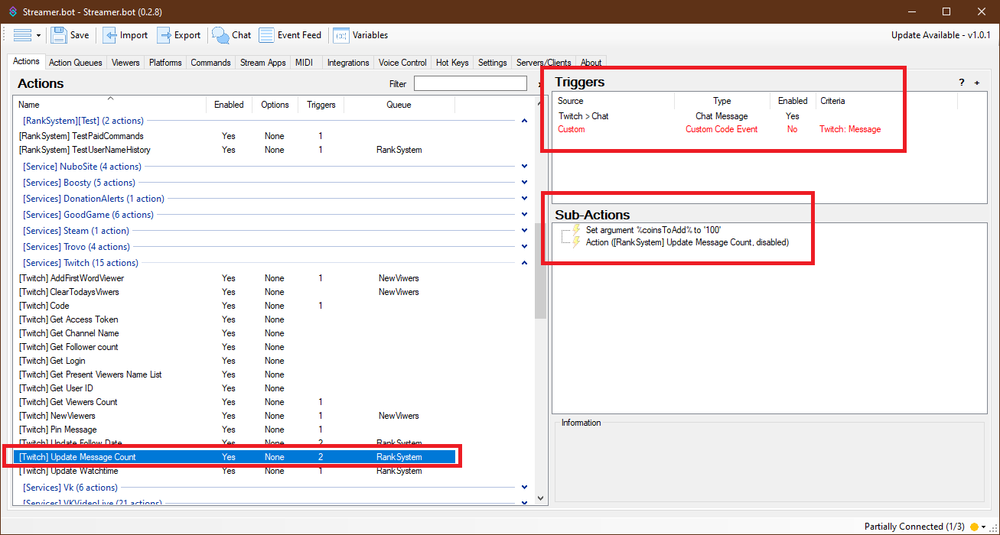

#### \[RankSystem] Update Watchtime
Обновляет время просмотра, при срабатывании.

- На данный момент этот экшен надо вызвать из отдельных экшенов для каждой площадки. Нужно дополнительное тестирование.
- Для корректной работы необходимо задать аргумент `timeToAdd`. В аргументе указывается время в секундах, заданное на таймере present viewers для конкретной площадки.
- Для начисления валюты за период необходимо задать аргумент `coinsToAdd`.
Ниже представлен пример настройки для твича.
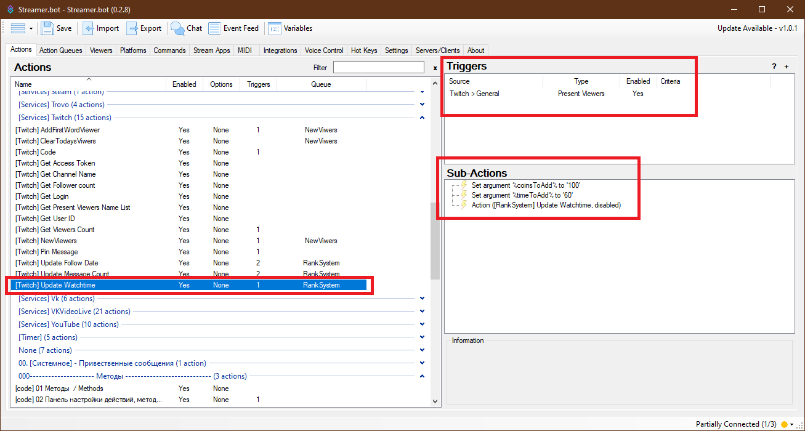

#### \[RankSystem] DataBaseForm
Открывает форму просмотра и редактирования базы данных зрителей.